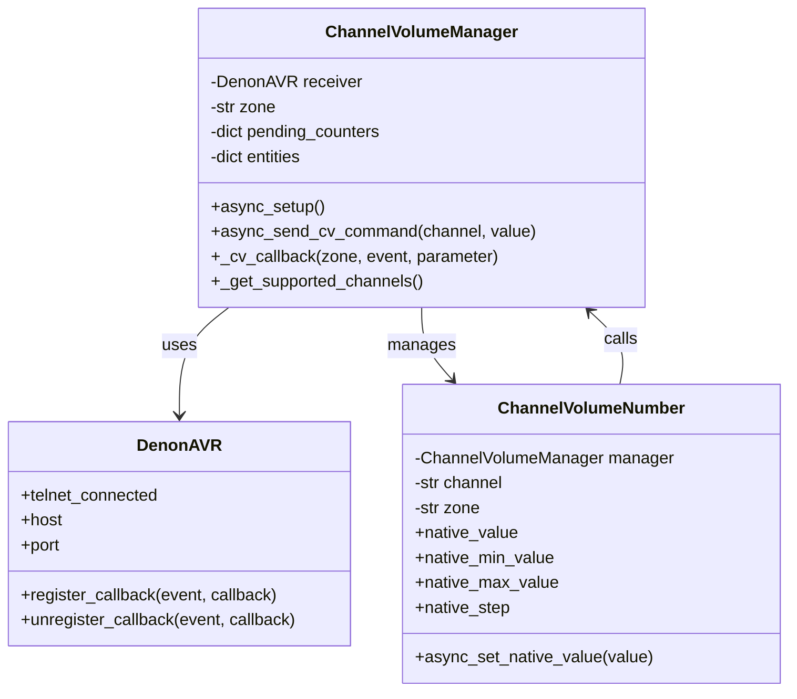
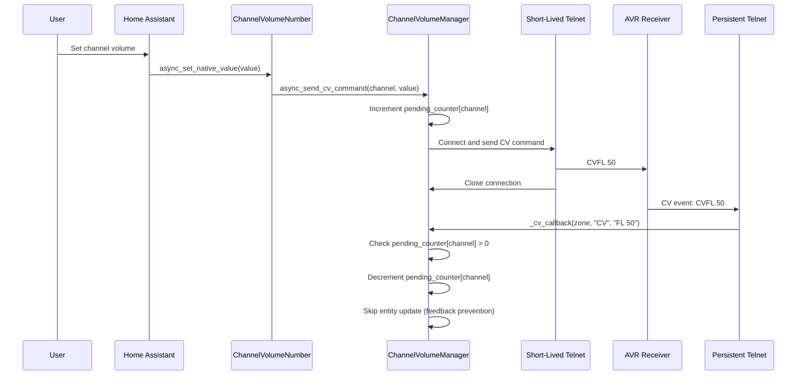

# Design Document: Channel Volume Controls

## Overview

This design adds individual speaker channel volume control to the marantzplus Home Assistant custom component. The feature enables users to adjust volume levels for individual audio channels (front left, front right, center, surround left, surround right, subwoofer) through Home Assistant number entities.

The implementation leverages the existing denonavr library's built-in support for CV (Channel Volume) telnet events while adding a new ChannelVolumeManager class to handle entity creation, command sending, and state synchronization. The design maintains backward compatibility with existing functionality and supports multi-zone configurations.

### Key Design Decisions

1. **Leverage Existing Library Support**: The denonavr library (v1.2.0) already includes CV in its TELNET_EVENTS set and provides CHANNEL_MAP and CHANNEL_VOLUME_MAP for conversions. We extend this rather than reimplementing.

2. **Hybrid Telnet Approach**: Use the library's persistent telnet connection for receiving CV events, but create short-lived telnet connections for sending CV commands (since the library doesn't expose CV command methods).

3. **Pending Counter Pattern**: Implement a per-channel pending counter to prevent feedback loops when sending commands that trigger CV events.

4. **Number Entity Platform**: Use Home Assistant's number entity platform for channel volume controls, providing a native UI experience with proper min/max bounds and step sizes.

5. **Automatic Discovery**: Create channel volume entities automatically during integration setup without requiring additional user configuration.

## Architecture

### Component Structure

```
custom_components/marantzplus/
├── __init__.py                    # Modified: Add number platform
├── channel_volume.py              # New: ChannelVolumeManager and entities
├── number.py                      # New: Number platform setup
├── const.py                       # Modified: Add CV constants
└── (existing files unchanged)
```

### Class Diagram



### Data Flow



## Components and Interfaces

### ChannelVolumeManager

The central coordinator for channel volume functionality.

**Responsibilities:**
- Create and manage ChannelVolumeNumber entities
- Send CV commands via short-lived telnet connections
- Receive CV events via the library's persistent telnet connection
- Prevent feedback loops using pending counters
- Query receiver for supported channels

**Interface:**

```python
class ChannelVolumeManager:
    def __init__(
        self,
        receiver: DenonAVR,
        zone: str,
        hass: HomeAssistant,
    ) -> None:
        """Initialize the channel volume manager."""
        
    async def async_setup(self) -> list[ChannelVolumeNumber]:
        """Set up channel volume entities.
        
        Returns:
            List of ChannelVolumeNumber entities to add to Home Assistant.
        """
        
    async def async_send_cv_command(
        self,
        channel: str,
        value: float,
    ) -> None:
        """Send a channel volume command to the receiver.
        
        Args:
            channel: Channel code (FL, FR, C, SL, SR, SW)
            value: Volume in dB (-12.0 to +12.0)
            
        Raises:
            AvrNetworkError: If telnet connection fails
        """
        
    def _cv_callback(
        self,
        zone: str,
        event: str,
        parameter: str,
    ) -> None:
        """Handle CV events from the persistent telnet connection.
        
        Args:
            zone: Zone identifier (Main, Zone2, Zone3, or ALL_ZONES)
            event: Event type (should be "CV")
            parameter: Event parameter (e.g., "FL 50")
        """
        
    async def _get_supported_channels(self) -> list[str]:
        """Query receiver for supported channels.
        
        Returns:
            List of supported channel codes (FL, FR, C, SL, SR, SW)
        """
```

**Key Attributes:**

```python
# Channel mapping from denonavr library
CHANNEL_MAP = {
    "FL": "Front Left",
    "FR": "Front Right",
    "C": "Center",
    "SL": "Surround Left",
    "SR": "Surround Right",
    "SW": "Subwoofer",
}

# Volume conversion
# Protocol uses offset of 50 (0 dB = 50)
# Whole dB: 2-digit string (e.g., "53" = +3.0 dB)
# Half dB: 3-digit string (e.g., "535" = +3.5 dB)
# Range: 38-62 (whole dB), 385-625 (half dB)
# Display range: -12.0 to +12.0 dB
CHANNEL_VOLUME_OFFSET = 50
MIN_CHANNEL_VOLUME_DB = -12.0
MAX_CHANNEL_VOLUME_DB = 12.0
CHANNEL_VOLUME_STEP_DB = 0.5
```

### ChannelVolumeNumber

Home Assistant number entity for individual channel volume control.

**Responsibilities:**
- Represent a single channel's volume as a number entity
- Handle user input and send commands via the manager
- Display current volume state
- Provide proper entity metadata (name, unique_id, device_info)

**Interface:**

```python
class ChannelVolumeNumber(NumberEntity):
    def __init__(
        self,
        manager: ChannelVolumeManager,
        channel: str,
        zone: str,
        device_info: DeviceInfo,
        unique_id_base: str,
    ) -> None:
        """Initialize the channel volume number entity."""
        
    async def async_set_native_value(self, value: float) -> None:
        """Set the channel volume.
        
        Args:
            value: Volume in dB (-12.0 to +12.0)
        """
        
    @property
    def native_value(self) -> float | None:
        """Return the current channel volume in dB."""
        
    @property
    def native_min_value(self) -> float:
        """Return minimum volume (-12.0 dB)."""
        
    @property
    def native_max_value(self) -> float:
        """Return maximum volume (+12.0 dB)."""
        
    @property
    def native_step(self) -> float:
        """Return volume step size (0.5 dB)."""
        
    @property
    def native_unit_of_measurement(self) -> str:
        """Return unit of measurement (dB)."""
```

**Entity Naming:**
- Entity ID (Main Zone): `number.{device_name}_channel_{channel_name}_volume`
- Entity ID (Zone2): `number.{device_name}_zone2_channel_{channel_name}_volume`
- Entity ID (Zone3): `number.{device_name}_zone3_channel_{channel_name}_volume`
- Display Name (Main Zone): `Channel {Channel Name} Volume`
- Display Name (Zone2): `Zone2 Channel {Channel Name} Volume`
- Display Name (Zone3): `Zone3 Channel {Channel Name} Volume`
- Examples:
  - Main: `number.denon_avr_channel_front_left_volume` → "Channel Front Left Volume"
  - Zone2: `number.denon_avr_zone2_channel_front_left_volume` → "Zone2 Channel Front Left Volume"

### Number Platform Setup

New `number.py` file to handle platform registration.

**Interface:**

```python
async def async_setup_entry(
    hass: HomeAssistant,
    config_entry: DenonavrConfigEntry,
    async_add_entities: AddConfigEntryEntitiesCallback,
) -> None:
    """Set up channel volume number entities from a config entry.
    
    Creates ChannelVolumeManager instances for each zone and
    adds all channel volume entities to Home Assistant.
    """
```

### Integration Entry Point Modifications

Modifications to `__init__.py`:

```python
# Add number platform to PLATFORMS list
PLATFORMS = [Platform.MEDIA_PLAYER, Platform.NUMBER]

# No other changes needed - platform forwarding handles the rest
```

### Constants

New constants in `const.py`:

```python
# Channel volume constants
CHANNEL_MAP = {
    "FL": "Front Left",
    "FR": "Front Right", 
    "C": "Center",
    "SL": "Surround Left",
    "SR": "Surround Right",
    "SW": "Subwoofer",
}

# Protocol value to dB conversion
# Protocol: 38-62 (integer), Display: -12.0 to +12.0 dB (float)
MIN_CHANNEL_VOLUME_DB = -12.0
MAX_CHANNEL_VOLUME_DB = 12.0
CHANNEL_VOLUME_STEP_DB = 0.5
MIN_CHANNEL_VOLUME_PROTOCOL = 38
MAX_CHANNEL_VOLUME_PROTOCOL = 62

# Telnet connection timeout for CV commands
CV_TELNET_TIMEOUT = 5.0
```

## Data Models

### Pending Counter State

```python
# Per-channel pending counter dictionary
pending_counters: dict[str, int] = {
    "FL": 0,
    "FR": 0,
    "C": 0,
    "SL": 0,
    "SR": 0,
    "SW": 0,
}
```

**Invariants:**
- Counter value must be >= 0
- Counter incremented before sending CV command
- Counter decremented when CV event received with counter > 0
- Entity update skipped when counter > 0

### Channel Volume State

```python
# Per-channel current volume in dB
channel_volumes: dict[str, float | None] = {
    "FL": None,  # None indicates unknown/not yet received
    "FR": None,
    "C": None,
    "SL": None,
    "SR": None,
    "SW": None,
}
```

### CV Event Format

CV events from the receiver follow this format:

```
CV<channel> <value>

Examples:
CVFL 50    # Front Left at 50 (0.0 dB) - 2-digit for whole dB
CVFR 45    # Front Right at 45 (-2.5 dB) - would be "455" for -2.5 dB
CVC 38     # Center at 38 (-12.0 dB) - 2-digit for whole dB
CVSW 535   # Subwoofer at 535 (+3.5 dB) - 3-digit for half dB
```

**Protocol Format:**
- **2-digit**: Whole dB values (e.g., "50" = 0.0 dB, "53" = +3.0 dB)
- **3-digit**: Half dB values (e.g., "535" = +3.5 dB, "505" = +0.5 dB)
- **Offset**: 50 (so 50 = 0.0 dB)

### CV Command Format

CV commands sent to the receiver:

```
CV<channel> <value>

Examples:
CVFL 50    # Set Front Left to 50 (0.0 dB)
CVFR 535   # Set Front Right to 535 (+3.5 dB)
CVC 38     # Set Center to 38 (-12.0 dB)
```

For this implementation, we use absolute values only (not UP/DOWN).

### Value Conversion

**Protocol to dB:**
```python
def protocol_to_db(protocol_value: str, offset: int = 50) -> float:
    """Convert protocol value to dB.
    
    Args:
        protocol_value: String from receiver (2-digit or 3-digit)
        offset: Protocol offset (default 50, so 50 = 0.0 dB)
        
    Returns:
        Volume in dB
        
    Examples:
        "53" → +3.0 dB (53 - 50)
        "535" → +3.5 dB (535 / 10 - 50)
        "50" → 0.0 dB
        "38" → -12.0 dB
    """
    protocol_value = protocol_value.strip()
    raw = int(protocol_value)
    if len(protocol_value) == 3:
        # 3-digit: half dB step
        return raw / 10 - offset
    # 2-digit: whole dB step
    return float(raw - offset)
```

**dB to Protocol:**
```python
def db_to_protocol(db_value: float, offset: int = 50) -> str:
    """Convert dB to protocol value.
    
    Args:
        db_value: Volume in dB (-12.0 to +12.0)
        offset: Protocol offset (default 50, so 0.0 dB = 50)
        
    Returns:
        Protocol string (2-digit for whole dB, 3-digit for half dB)
        
    Examples:
        +3.0 → "53" (whole dB)
        +3.5 → "535" (half dB)
        0.0 → "50"
        -12.0 → "38"
    """
    if db_value % 1 == 0:
        # Whole dB: 2-digit string
        return str(int(db_value) + offset)
    # Half dB: 3-digit string
    return str(int((db_value + offset) * 10))
```

### Zone Prefixes

For multi-zone support, CV commands are prefixed based on the zone name from the denonavr library:

```python
# Zone names from denonavr library
MAIN_ZONE = "Main"
ZONE2 = "Zone2"
ZONE3 = "Zone3"

# Zone prefixes for CV commands
ZONE_PREFIXES = {
    "Main": "",      # No prefix for main zone
    "Zone2": "Z2",   # Z2CVFL 50
    "Zone3": "Z3",   # Z3CVFL 50
}

# Entity ID suffixes (lowercase, omit for Main)
def get_zone_suffix(zone: str) -> str:
    """Get zone suffix for entity ID.
    
    Returns:
        "" for Main zone (omitted)
        "zone2" for Zone2
        "zone3" for Zone3
    """
    if zone == "Main":
        return ""
    return zone.lower()
```

## 
Correctness Properties

*A property is a characteristic or behavior that should hold true across all valid executions of a system-essentially, a formal statement about what the system should do. Properties serve as the bridge between human-readable specifications and machine-verifiable correctness guarantees.*

### Property 1: Entity Configuration Consistency

*For any* channel volume number entity, the entity SHALL have a minimum value of -12.0 dB, maximum value of +12.0 dB, step size of 0.5 dB, and unit of measurement "dB".

**Validates: Requirements 1.2, 1.3, 1.4**

### Property 2: Entity ID Format

*For any* device name, zone name, and channel name, the generated entity ID SHALL follow the pattern `number.{device_name}_channel_{channel_name}_volume` for Main Zone, and `number.{device_name}_zone{N}_channel_{channel_name}_volume` for Zone2 and Zone3, with proper sanitization.

**Validates: Requirements 1.5, 7.2**

### Property 3: Value Conversion Round Trip

*For any* valid dB value in the range [-12.0, +12.0], converting to protocol format and back to dB SHALL produce the original value (within floating point precision).

**Validates: Requirements 2.4, 3.3**

### Property 4: Command Sending Creates Connection

*For any* channel and valid volume value, when async_send_cv_command is called, a short-lived telnet connection SHALL be created and a CV command SHALL be sent.

**Validates: Requirements 2.1, 2.2**

### Property 5: Connection Cleanup Timing

*For any* CV command sent via short-lived telnet connection, the connection SHALL be closed within 5 seconds of creation.

**Validates: Requirements 2.3, 5.4**

### Property 6: Pending Counter Increment

*For any* channel, when async_send_cv_command is called, the pending counter for that channel SHALL be incremented before the command is sent.

**Validates: Requirements 2.5, 4.1**

### Property 7: Pending Counter Prevents Update

*For any* CV event received when the pending counter for that channel is greater than zero, the counter SHALL be decremented and the entity SHALL NOT be updated.

**Validates: Requirements 3.4, 4.2**

### Property 8: Zero Counter Allows Update

*For any* CV event received when the pending counter for that channel is zero, the corresponding number entity SHALL be updated with the received value.

**Validates: Requirements 3.5, 4.3**

### Property 9: Per-Channel Counter Isolation

*For any* two different channels, incrementing or decrementing the pending counter for one channel SHALL NOT affect the pending counter for the other channel.

**Validates: Requirements 4.4**

### Property 10: Counter Non-Negativity Invariant

*For any* channel at any point in time, the pending counter SHALL be greater than or equal to zero.

**Validates: Requirements 4.5**

### Property 11: CV Event Updates Entity

*For any* CV event received via the persistent telnet connection with pending counter at zero, the corresponding number entity SHALL be updated with the converted dB value.

**Validates: Requirements 3.1**

### Property 12: Zone Prefix in Commands

*For any* zone (Main, Zone2, Zone3) and channel, the CV command sent SHALL include the appropriate zone prefix ("" for Main, "Z2" for Zone2, "Z3" for Zone3).

**Validates: Requirements 7.3**

### Property 13: Zone Event Routing

*For any* CV event received with a zone identifier, the event SHALL be routed to update the number entity for the correct zone and channel combination.

**Validates: Requirements 7.4**

### Property 14: Multi-Zone Entity Creation

*For any* set of configured zones, the Channel_Volume_Manager SHALL create number entities for each channel in each configured zone.

**Validates: Requirements 7.1**

### Property 15: Conditional Entity Creation

*For any* set of supported channels returned by the receiver, the Channel_Volume_Manager SHALL create number entities only for those channels and SHALL NOT create entities for unsupported channels.

**Validates: Requirements 8.2, 8.3, 8.4**

### Property 16: Connection Failure Error Handling

*For any* channel volume command, if the short-lived telnet connection fails to connect, an error SHALL be logged and the number entity value SHALL remain unchanged.

**Validates: Requirements 9.1**

### Property 17: Send Failure Counter Recovery

*For any* channel volume command, if the CV command fails to send after the pending counter was incremented, the pending counter SHALL be decremented.

**Validates: Requirements 9.2**

### Property 18: Invalid Event Handling

*For any* CV event with invalid data (malformed channel code or value), a warning SHALL be logged and the event SHALL be ignored without updating any entity.

**Validates: Requirements 9.4**

### Property 19: Exception Safety

*For any* error condition (connection failure, invalid data, timeout), the Channel_Volume_Manager SHALL NOT raise unhandled exceptions that would cause the integration to unload.

**Validates: Requirements 9.5**

### Property 20: Connection Parameter Consistency

*For any* Channel_Volume_Manager instance, the telnet connection parameters (host, port) used for short-lived connections SHALL match the parameters used by the denonavr library's persistent connection.

**Validates: Requirements 10.4**

## Error Handling

### Connection Errors

**Short-Lived Telnet Connection Failures:**
- Catch `AvrNetworkError` and `AvrTimoutError` from connection attempts
- Log error with receiver host and channel information
- Decrement pending counter if it was incremented
- Leave entity state unchanged
- Do not propagate exception to Home Assistant

**Persistent Telnet Disconnection:**
- Continue to allow sending CV commands via short-lived connections
- Entities will not receive updates until persistent connection is restored
- No error state for entities - they remain at last known value
- Library handles reconnection automatically

### Invalid Data Errors

**Malformed CV Events:**
- Validate channel code against CHANNEL_MAP
- Validate protocol value is in range 38-62
- Log warning with raw event data
- Ignore event without updating entity
- Do not propagate exception

**Out of Range Values:**
- Number entity platform enforces min/max bounds
- Additional validation in async_set_native_value
- Clamp values to valid range before conversion
- Log warning if clamping occurs

### Timeout Errors

**Command Send Timeout:**
- Set 5-second timeout on short-lived telnet connections
- Catch timeout exceptions
- Log error with channel and value information
- Decrement pending counter
- Close connection in finally block

### State Consistency Errors

**Pending Counter Underflow:**
- Check counter > 0 before decrementing
- Log warning if underflow would occur
- Set counter to 0 instead of negative value
- This should never happen in normal operation

**Unknown Channel in Event:**
- Check if channel exists in entities dictionary
- Log warning with channel code
- Ignore event
- May indicate receiver supports channels we don't know about

### Error Recovery

**Automatic Recovery:**
- Short-lived connection failures are transient - next command attempt may succeed
- Persistent connection managed by library with automatic reconnection
- Pending counters reset to 0 on integration reload
- Entity states persist across temporary failures

**Manual Recovery:**
- User can reload integration via Home Assistant UI
- User can restart Home Assistant
- User can power cycle receiver
- No data loss - entity states are maintained by Home Assistant

### Logging Strategy

**Error Level:**
- Connection failures to receiver
- Command send failures
- Unexpected exceptions

**Warning Level:**
- Malformed CV events
- Unknown channels
- Value clamping
- Pending counter underflow

**Debug Level:**
- Successful command sends
- CV event processing
- Pending counter changes
- Entity updates

## Testing Strategy

### Dual Testing Approach

This feature requires both unit tests and property-based tests for comprehensive coverage:

**Unit Tests** focus on:
- Specific examples of entity creation
- Integration with Home Assistant platforms
- Callback registration with denonavr library
- Configuration and setup flows
- Edge cases like missing telnet support
- Error conditions with specific inputs

**Property-Based Tests** focus on:
- Universal properties across all channels and values
- Value conversion correctness
- Pending counter invariants
- Multi-zone behavior
- Error handling across random inputs
- State consistency under various operations

### Property-Based Testing Configuration

**Library:** Use `hypothesis` for Python property-based testing

**Test Configuration:**
- Minimum 100 iterations per property test
- Each test tagged with comment referencing design property
- Tag format: `# Feature: channel-volume-controls, Property {number}: {property_text}`

**Example Property Test Structure:**

```python
from hypothesis import given, strategies as st
import pytest

@given(
    channel=st.sampled_from(["FL", "FR", "C", "SL", "SR", "SW"]),
    db_value=st.floats(min_value=-12.0, max_value=12.0, allow_nan=False)
)
@pytest.mark.parametrize("iterations", [100])
def test_value_conversion_round_trip(channel, db_value):
    """Feature: channel-volume-controls, Property 3: Value conversion round trip"""
    # Convert dB to protocol and back
    protocol_value = db_to_protocol(db_value)
    result_db = protocol_to_db(protocol_value)
    
    # Should be equal within floating point precision
    assert abs(result_db - db_value) < 0.01
```

### Unit Test Coverage

**Entity Creation Tests:**
- Test standard 6-channel entity creation (Property 1.1)
- Test entity configuration properties (bounds, step, unit)
- Test entity ID formatting with various device/zone names
- Test multi-zone entity creation (Main, Zone2, Zone3)
- Test conditional entity creation based on supported channels
- Test fallback to all channels when query fails

**Command Sending Tests:**
- Test CV command format for each channel
- Test zone prefix application (Main, Zone2, Zone3)
- Test short-lived connection creation and cleanup
- Test pending counter increment before send
- Test connection failure error handling
- Test send failure counter recovery

**Event Handling Tests:**
- Test CV event parsing and entity update
- Test pending counter decrement on event
- Test entity update skip when counter > 0
- Test zone routing for events
- Test invalid event handling
- Test unknown channel handling

**Integration Tests:**
- Test callback registration with denonavr library
- Test platform registration with Home Assistant
- Test automatic initialization on setup
- Test operation without persistent telnet
- Test persistent telnet disconnection handling

**Error Handling Tests:**
- Test connection timeout handling
- Test malformed event handling
- Test out of range value handling
- Test exception safety (no unhandled exceptions)

### Property Test Coverage

Each correctness property (1-20) should have a corresponding property-based test:

1. **Entity Configuration Consistency** - Test all entities have correct bounds/step/unit
2. **Entity ID Format** - Test ID generation with random device/zone/channel names
3. **Value Conversion Round Trip** - Test dB ↔ protocol conversion
4. **Command Sending Creates Connection** - Test connection creation for all channels
5. **Connection Cleanup Timing** - Test connections close within timeout
6. **Pending Counter Increment** - Test counter increments for all commands
7. **Pending Counter Prevents Update** - Test update skip when counter > 0
8. **Zero Counter Allows Update** - Test update occurs when counter = 0
9. **Per-Channel Counter Isolation** - Test counters are independent
10. **Counter Non-Negativity Invariant** - Test counter never negative
11. **CV Event Updates Entity** - Test entity updates from events
12. **Zone Prefix in Commands** - Test correct prefix for all zones
13. **Zone Event Routing** - Test events route to correct zone
14. **Multi-Zone Entity Creation** - Test entities for all configured zones
15. **Conditional Entity Creation** - Test entity creation matches support
16. **Connection Failure Error Handling** - Test graceful failure handling
17. **Send Failure Counter Recovery** - Test counter recovery on failure
18. **Invalid Event Handling** - Test malformed event rejection
19. **Exception Safety** - Test no unhandled exceptions
20. **Connection Parameter Consistency** - Test parameters match library

### Test Fixtures and Mocks

**Mock Objects:**
- Mock DenonAVR receiver with configurable zones
- Mock telnet connection with controllable success/failure
- Mock Home Assistant core and entity platform
- Mock callback registration

**Test Fixtures:**
- Receiver configurations (single zone, multi-zone)
- Channel support configurations (all, subset, none)
- CV event samples (valid, invalid, malformed)
- Connection parameters (host, port, timeout)

### Integration Testing

**Home Assistant Test Environment:**
- Use Home Assistant test framework
- Test with actual denonavr library (not mocked)
- Test with mock telnet server
- Verify entity registration and discovery
- Verify UI rendering of number entities

**Continuous Integration:**
- Run all tests on every commit
- Enforce minimum code coverage (80%)
- Run property tests with increased iterations (1000) in CI
- Test against multiple Home Assistant versions

